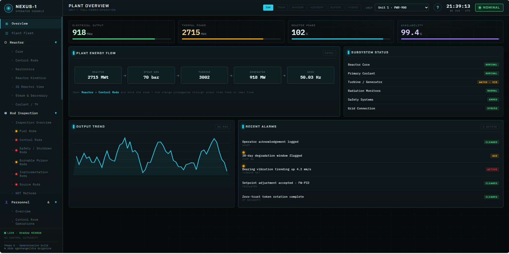
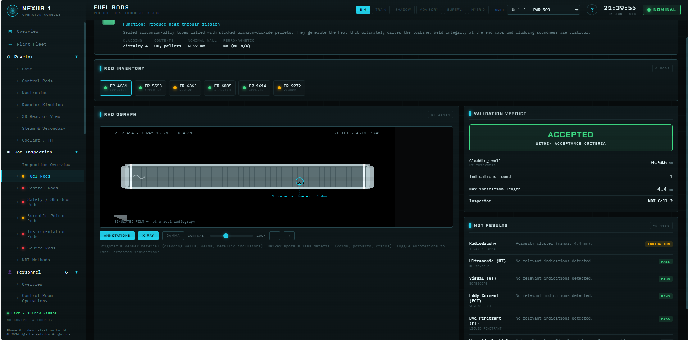

# NEXUS-1 — Phase 0

> **Nuclear Plant Operator Console & Digital-Twin Platform** — an interactive, single-file demonstration of a complete nuclear power facility, driven by a live in-browser simulation.

-0e7490)


NEXUS-1 presents an entire plant — reactor physics, power generation, the secondary and electrical systems, safety and radiation monitoring, a multi-unit fleet, component ageing and decommissioning, staffing, a robotic fleet, zone access control, and analytical tools — through one navigable interface. Everything runs locally in a single HTML file, with no server, account, or build step.

This repository is **Phase 0**: the demonstration and design phase. The path to a production system is in the [Project Roadmap](#-documentation).

---

> ⚠️ **Scope — please read first.** NEXUS-1 is a **demonstration and educational project**. It is **not connected to any real reactor, sensor, or control system**, and its models are studied and representative rather than validated or certified. The strength of the project is in its software design, simulation, visualisation, and systems thinking — not in claiming nuclear-engineering validity. By design, it is a monitoring / analytics / advisory layer with **no control authority**: it never controls or bypasses certified safety systems.

---

## Table of contents

- [Demo](#-demo)
- [Quick start](#-quick-start)
- [Screenshots](#-screenshots)
- [Features](#-features)
- [Real vs. simulated](#-real-vs-simulated)
- [Architecture & roadmap](#-architecture--roadmap)
- [Documentation](#-documentation)
- [Author & licence](#-author--licence)

---

## 🚀 Demo

The application is a single HTML file — open it in any modern browser and it just runs.

**Host it free on GitHub Pages** (recommended — it also gives the project a public, dated record):

1. Create a public repository and push these files.
2. Rename the application file to **`index.html`** (GitHub Pages serves that by default).
3. In the repo: **Settings → Pages → Build and deployment → Deploy from a branch → `main` / `(root)` → Save**.
4. Wait a minute, then open `https://<your-username>.github.io/<repo-name>/`.

> **Note:** one screen (the *3D Reactor View*) loads a 3D library from a public CDN, so it needs internet access to render. Everything else works fully offline.

## ⚡ Quick start

```bash
git clone https://github.com/<your-username>/<repo-name>.git
cd <repo-name>
# then simply open the .html file in your browser (e.g. double-click it)
```

**First tour (shows how the screens connect):** open **Reactor → Control Rods**, move the rod bank, then press **SCRAM**. Now check **Incident Analysis** and **Compliance** to see the event recorded, and **Rod Inspection** to see the rods flagged for post-trip inspection — one action rippling across the whole system.

## 🖼️ Screenshots

> Add a few PNGs to a `docs/` folder and reference them here, for example:

```markdown



```

<!-- Suggested shots: Plant Overview, Reactor Core, 3D Reactor View, System Dependencies graph, Reactor Kinetics, Optimization (RL). -->

## ✨ Features

- **Fleet & overview** — multi-unit fleet (PWR units + SMR modules) with on/off toggling, grid aggregation, and a unit selector that propagates across the unit-specific screens.
- **Reactor** — per-unit core map, interactive control rods + SCRAM, neutronics, a genuine **point-kinetics** simulator (6 delayed-neutron groups; Doppler / moderator / xenon feedback), and a **3D digital-twin view** (telemetry vs. model).
- **Secondary & electrical** — steam/secondary, coolant loops, power & grid synchronisation.
- **Monitoring & safety** — radiation, alarms, incident analysis, a hash-sealed compliance/audit log, and OT-security posture.
- **Analysis & intelligence** — AI predictive diagnostics; an experimental **reinforcement-learning optimiser** (BETA, twin-only, advisory, interpretable); a **system-dependencies** graph / influence-matrix / causal-chain; digital twin; and trends.
- **Integrity & lifecycle** — rod inspection (NDT), component ageing & degradation, and decommissioning.
- **People, robots & access** — personnel + staffing stress test, a robotic/vehicle fleet + mission readiness, and zone access (live presence + permissions matrix).
- **Connected behaviour** — a SCRAM ripples into incidents, compliance, inspection, and ageing; operation accrues component life; the unit selector drives the relevant screens.

## 🔬 Real vs. simulated

| Real / genuine | Simulated / illustrative |
| --- | --- |
| The interface, navigation, visualisations and interactions are working code. | All data is generated in the browser; nothing connects to a real plant. |
| The reactor-kinetics physics and the RL agent are real in structure and genuinely compute/learn. | Their constants are representative, not tuned to a specific reactor. |
| Workflows reflect real industry concepts (NDT, staffing rules, dose limits, decommissioning stages). | Ageing figures, dependency weights, names, ratings and dates are plausible placeholders. |

## 🏗️ Architecture & roadmap

**Phase 0 (this repo):** a single self-contained HTML/CSS/JavaScript file — hand-written SVG for diagrams/charts, and a WebGL library for the 3D view. No framework, no build step.

**Production target (future phases):**

- **Backend:** .NET (C#) microservices — ASP.NET Core; REST + gRPC. *(No Orleans.)*
- **Front end:** Angular SPA.
- **Real-time:** SignalR for live updates to the client.
- **Relational data:** Microsoft SQL Server (config, master data, audit/compliance).
- **Messaging:** Azure Service Bus for events/commands; **Azure Event Hubs** (or Kafka) for the high-rate telemetry stream.
- **Ops:** Docker + Kubernetes; OpenTelemetry for observability.

The goal is a platform active in all of its modes — **Training, Shadow, Advisory, Supervisory and Hybrid Digital Twin** — built out from the Phase 0 Simulation baseline. Any future plant integration is **read-only** until — and unless — a formal assurance and certification path is completed. See the **Project Roadmap** for the phase-by-phase plan and indicative effort.

## 📚 Documentation

A full set of PDFs accompanies the application:

- **Functional Guide (Phase 0)** — an analytical walk-through of every screen and how the parts connect.
- **Glossary of Terms** — a plain-English guide to every term in the console, for non-engineers.
- **Project Roadmap** — the phased plan, the intended stack, and an indicative effort estimate.
- **Project Brief** — a one-look overview.

## 👤 Author & licence

Created by **Grigorios Agathangelidis** (Electrical & Software Engineering) as a personal project — an effort to study the nuclear-energy domain and apply software-architecture, simulation, visualisation and systems-design skills to it. It does not claim nuclear-engineering expertise, and it is careful to mark where its models are illustrative.

Build signature: `NX1-094C79E0A366D34F`

© 2026 Grigorios Agathangelidis. **All rights reserved.** See [`LICENSE.txt`](LICENSE.txt). This is a demonstration and educational tool; it is not a licensed analysis tool and is not connected to any real reactor.
